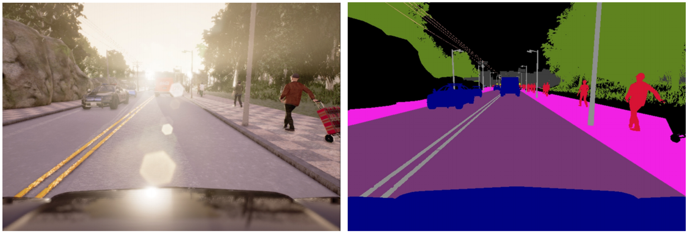
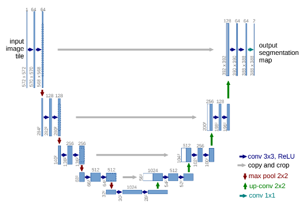
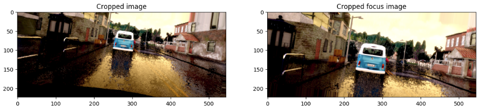
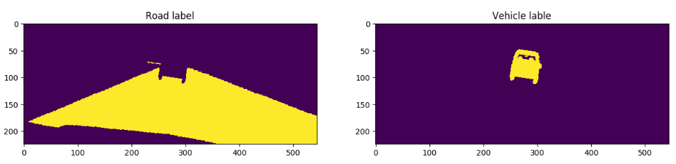
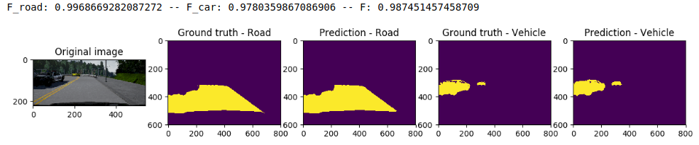
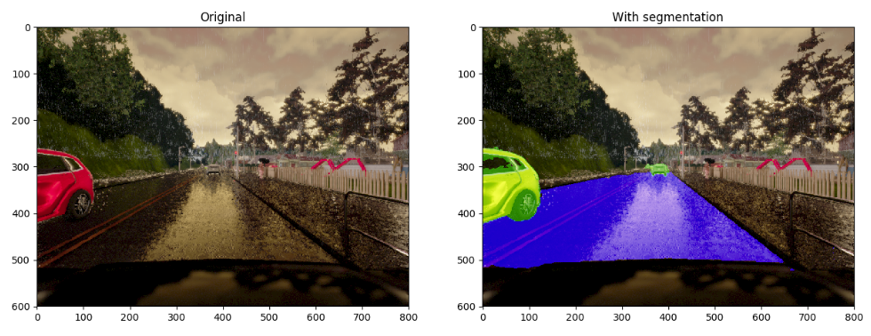
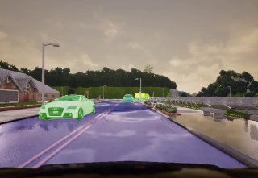
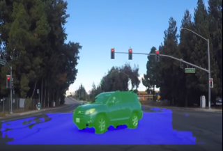

#Lyft challenge (semantic segmentation)

###Overview
The goal of the challenge is to do a pixel-wise identification of objects from a front car camera. 

The images are generated from [CARLA](http://carla.org/), an open-source simulator for autonomous driving. It includes a virtual world with dynamic objects like cars and pedestrians and differents weather conditions. It also includes a set of sensors like cameras with different post-processing, one is the semantic segmentation with 14 differents classes.

**Here is an example from the simulator, on the left the camera image and on the right the segmentation with the different classes**


The challenge is limited to two types of objects, the drivable road as well as the vehicles.

### Run on the udacity workspace

In order to run on the udacity workspace and get graded we need to run the following `./preinstall_script.sh` to install the packages required by the script then `grader 'python ./Lyft_challenge.py'` and it should give you an output like this
```
Your program has run, now scoring...

Your program runs at 13.157 FPS

Car F score: 0.847 | Car Precision: 0.729 | Car Recall: 0.883 | Road F score: 0.987 | Road Precision: 0.990 | Road Recall: 0.974 | Averaged F score: 0.917

If you are satisfied with your results and have no errors, make sure you have filled out your JWT file and then submit your solution by typing 'submit' at the command line.

########################################
############ Ending Grader #############
########################################

```

### Reproduce the results

To reproduce the results you will need to gather data from CARLA using the script `carla_datagenerator.py`, then use the jupyter notebook `Lyft_challenge.ipynb` to train the network on your new dataset. Then you can use `Freeze graph.ipynb` to freeze the keras model and `Optimize_for_inference.ipynb` to optimize it. From there you can put the model in Models folder, name it `keras_opt_model.pb` and use `Lyft_challenge.py` to do inference on video.


### Datasets

 We are given a training set of 1000 images and the corresponding segmentation extracted from CARLA.
 
 The first thing to do was to convert the segmented images to keep only the vehicles and the road. Also as part of the process we had to remove the hood of our car because it is not part of the evaluation. Code can be seen in the function `convert_carlaseg_to_challengeseg` from the Lyft_challeng jupyter notebook.
 
```python
def convert_carlaseg_to_challengeseg(ids, seg_folder=TRAIN_CAMSEG_FOLDER, out_folder=TRAIN_LABEL_FOLDER):
    '''
        Convert the segmented images from CARLA to the challenge format.
        Keep only the vehicles and merge road and roadlines into one class.
        It also removes the hood as it is not part of the challenge evaluation
        
        ids : list of ids to retrieve images from the folder
        seg_folder : Folder where the CARLA segmented images reside
        out_folder : Folder where the challenge segmented image will be saved
    '''
    # Loop over all images
    for img_id in tqdm(ids):
        img_seg = img_to_array(Image.open(f'{seg_folder}/{img_id}.png')).astype('uint8')
        labels = img_seg[:,:,0]
        
        # Merge label 6=roadlines and 7=road
        label_road = np.where(np.logical_or(labels == 6, labels == 7), 1, 0).astype('uint8')
        # Keep only 10=vehicles
        label_vehicle = np.where(labels == 10, 1, 0).astype('uint8')

        # Remove the hood by remove the blob close to the bottom
        blobs, nblobs = ndimage.label(label_vehicle)
        blob_num = blobs[590, 400]
        label_vehicle[blobs == blob_num] = 0

        # Combine both in one image
        # Channel 0 -> Road
        # Channel 1 -> vehicle
        img_seg[:,:,0] = label_road
        img_seg[:,:,1] = label_vehicle

        # Save it back
        img = Image.fromarray(img_seg).convert('RGB')
        img.save(f'{out_folder}/{img_id}.png')
```

 After the conversion the binary labels of road are in the channel 0 and the vehicle one are in the channel 1.
 
 
#### More data
 
 After few tries with some networks it appears that we need more data to improve our accuracy. So i extracted from CARLA 7000 images, 500 images by weather available in the simulator. I saved one image every 10 frames to avoid to have look a like images. Code of the data collection used with CARLA is in `carla_datagenerator.py`
 
 This new dataset became my training set and the set already provided became my validation set.
 
 
### Architecture

To tackle this challenge i choose to use a [U-net](https://arxiv.org/abs/1505.04597) like network which has proven to be really good at segmentation.

**Here is an example of U-net architecture**




As the challenge as a speed component in the scroring, i choose to train the network from scratch rather than using any form of transfer learning. I thought that all networks available for transfer learning are too big and won't do good on the speed aspect.

After multiple iterations with different network size, input image size... i settle down with the below one.

- There is 2 images as input of the network, a cropped resized of the original image as well as a cropped image but not resize which act as a focus for small objects

- Input images are cropped to remove sky and almost all the hood. This is to get the most informational pixels in input of the network `CROP_REGION = (0,200,800,525)` as well as a focus cropped region `CROP_REGION_FOCUS = (128,188,672,412)`

- Cropped images are resized to meet network architecture which dowsize the image by 32, and to limit memory footprint. So we need an image size with multiple of 32. So i choose 224x544 to be as well close the aspect ratio of the image


- During training we use keras generator to do geometric augmentation. I am using random rotation, shear and horizontal flip as well as brightness and contrast. The generator can shuffle the dataset as well as making sure we do have some data for the car class.

```python
def data_generator(data_ids,img_size=NET_INPUT_IMG_SIZE, 
                   crop_region = CROP_REGION,crop_region_focus=CROP_REGION_FOCUS,
                   batch_size=4,
                   img_folder=TRAIN_IMAGE_FOLDER,label_folder=TRAIN_LABEL_FOLDER,
                   data_generator = ImageDataGenerator(rescale=1./255),
                   color_augmentation=False, car_minimum_pixel = 0, shufle_data=False
                  ):
    
    if shufle_data:
        img_ids = np.random.choice(data_ids,size=data_ids.shape[0],replace=False)
    else:
        img_ids = data_ids

    li = 0
    while True:
        X_batch_0 = []
        X_batch_1 = []
        y_batch = []
        for batch_i in range(batch_size):
            img_id = img_ids[li]
            seed = np.random.randint(1e6)

            # Make sure we get cars as this class is represented low
            img_seg = img_to_array(Image.open(f'{label_folder}/{img_id}.png').crop(crop_region))
            while np.sum(img_seg[:,:,1]) < car_minimum_pixel:
                # Next id
                li = (li + 1) % data_ids.shape[0]
                # Resuffle the ids if back to 0
                if li == 0 and shufle_data:
                    img_ids = np.random.choice(data_ids,size=data_ids.shape[0],replace=False)
                img_id = img_ids[li]
                img_seg = img_to_array(Image.open(f'{label_folder}/{img_id}.png').crop(crop_region))
            
            # Get the input image
            img_i = Image.open(f'{img_folder}/{img_id}.png')
            
            # Update contrast
            if color_augmentation and np.random.randint(2) == 1:
                enhancer = ImageEnhance.Contrast(img_i)
                img_i = enhancer.enhance(np.random.uniform(0.5,2.))

            # Update brightness
            if color_augmentation and np.random.randint(2) == 1:
                enhancer = ImageEnhance.Brightness(img_i)
                img_i = enhancer.enhance(np.random.uniform(0.5, 2.))

            # Get bot image for the network
            img_input = img_to_array(img_i.crop(crop_region).resize((img_size[1], img_size[0])))
            # Use the data generator to augment the image
            img_input = next(data_generator.flow(x=np.array([img_input]), batch_size=1, seed=seed))[0]
            
            img_focus = img_to_array(img_i.crop(crop_region_focus))
            # Use the data generator to augment the image
            img_focus = next(data_generator.flow(x=np.array([img_focus]), batch_size=1, seed=seed))[0]

            # Now get the labels
            img_seg = img_to_array(Image.open(f'{label_folder}/{img_id}.png').crop(crop_region).resize((img_size[1], img_size[0])))
            # Use the data generator to augment the labels the same way, use the same seed
            img_seg = next(data_generator.flow(x=np.array([img_seg]), batch_size=1, seed=seed))[0]
            # Need to put back only 0 and 1 due to transformation
            img_seg = np.where(img_seg > 0., 1., 0.)
            
            # Keep only the channels 0 and 1
            y = img_seg[:,:,:2]
                
            # Add this image to our batch
            X_batch_0.append(img_input)
            X_batch_1.append(img_focus)
            y_batch.append(y)
            
            # Next id
            li = (li + 1) % data_ids.shape[0]
            # Resuffle the ids if back to 0
            if li == 0 and shufle_data:
                img_ids = np.random.choice(data_ids,size=data_ids.shape[0],replace=False)


        yield [np.array(X_batch_0),np.array(X_batch_1)], np.array(y_batch)
```
 
**Here is an example of the output of the generator**




 
 - I use a specific loss function which combine the binary_crossentropy loss and a Fscore loss based on the challenge scoring. Only the binary_crossentropy was giving medium results especially on images with almost no car visible. The combination gave me the best results.
```python
 def F_beta_score(y_true, y_pred, beta=1.):
    TP = K.sum(y_pred * y_true) 
    FP = K.sum(y_pred * (1. - y_true)) 
    FN = K.sum((1. - y_pred) * y_true) 

    precision = TP/(TP+FP+K.epsilon())
    recall    = TP/(TP+FN+K.epsilon())
    
    return (1+beta**2) * ((precision*recall)/(beta**2 * precision + recall + K.epsilon()))

def Lyft_car_Fscore(y_true, y_pred):
    return F_beta_score(y_true[:,:,:,1], y_pred[:,:,:,1], beta=2.)

def Lyft_road_Fscore(y_true,y_pred):
    return F_beta_score(y_true[:,:,:,0], y_pred[:,:,:,0], beta=0.5)

def Lyft_FScore(y_true, y_pred):
    return (Lyft_car_Fscore(y_true, y_pred) + Lyft_road_Fscore(y_true, y_pred)) / 2.

def Lyft_loss(y_true, y_pred):
    return binary_crossentropy(y_true, y_pred) + 1 - Lyft_FScore(y_true,y_pred)

```
 
 - The training was performed on my local computer using the Adam optimizer with a learning rate of 1e-3, a batch size of 4 and for 40 epochs.
 
 - To finaly get our labels we need to threshold the network output. The network give us probability by pixel. So i choose for the road a threshold of 0.9 as we need precision and i choose 0.4 for the vehicle as we need more recall.
 
```python
        # Assign our prediction to our cropped region, anything outside is zero
        binary_road[CROP_REGION[1]:CROP_REGION[3]] = np.where(pred_r>0.9,1,0).astype('uint8')
        binary_car[CROP_REGION[1]:CROP_REGION[3]]  = np.where(pred_c>0.4,1,0).astype('uint8')
```
 
### Performance

The inference on the Udacity workspace provided for this challenge gave me a F2 score on vehicles of 0.8475 and a F0.5 score on road of 0.9867 at 13.5 FPS.

**Here is an example of the segmentation by the network on the validation set with the FScore assotiated**



**Here is another example of the segmentation by the network on the validation set**




When applied to a video we can see that the network is performing quite good and the test video provided for the challenge. Click on the image to get the video.

[](https://www.youtube.com/watch?v=mQITWa9D_H8) 


### Improvement

There is still room for improvement as we didn't get close to 100% accuracy, in order to improve i would try to gather more example of cars as it is more difficult on this class. I can also try to go deeper with the current network at the expense of the speed. I could also try different network architecture, like the use of fire modules from [Squeeze net](https://arxiv.org/pdf/1602.07360.pdf) or using atrous convolution from [Atrous paper](https://arxiv.org/pdf/1706.05587.pdf). Using different scales may as well improve the accuracy.


### Real world

When the network is applied to Carla images, it is doing a good job but on the real world images is doing less good. It is still able to recognize cars in some situation as well as the road. So i think it is encouraging that we could use simulator to train our models and apply it to real world.

Here isa video of the network applied to real world

[](https://www.youtube.com/watch?v=mQITWa9D_H8) 

To improve on the real world i would try to add with the augmentation more reality to the road surface by degrading the road lines, make it dashed. We could add deformation to the road to remove is perfection.
 